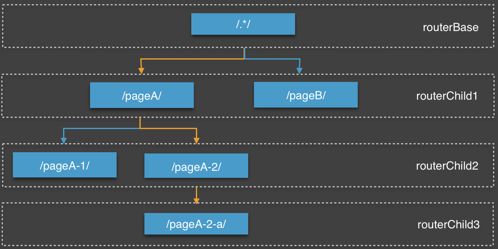
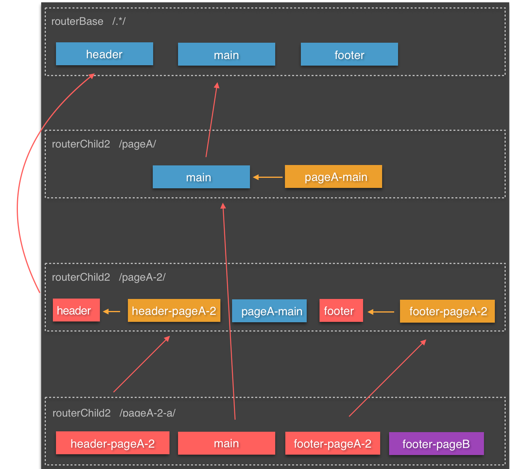

wowspg
==========

##关于wowspg

### wow单页系统简介
wow单页系统可以帮助开发者快速搭建一套前端单页面应用，wow框架主要包含：

* wowspg —— 前端Javascript单页面框架，单页面应用前端基础库
* wowui —— 前端基础样式库
* wowbuilder —— 单页面框架自动化编译工具，前端人员可以按照传统方式进行开发，由wowbuilder编译成为单页面，同时支持打包、压缩、本地测试等前端开发相关工具
* wowstyleguide —— wow框架代码开发规范

### wowspg基础架构
wowspg作为wow系统js基础库，可以脱离wow系统单独运行，支持开发者通过前端路由配置来实现PC端和wise端浏览器单页面应用。wowspg源码使用TypeScript进行编写，基于AMD规范编译产出js文件至output目录。


* 应用程序接口（Application）：开发者进行Block开发时需要实现的接口定义。主要包含：路由配置、Block 的前端模板、数据转换器、模板样式文件、模板逻辑处理器（其中包含block初始化即要执行的逻辑处理、block初始化完成时需要执行的处理器和block完全加载完是执行的处理器）
* 单页核心程序（single page core）：单页面架构的核心架构。主要包含：前端路由核心处理器、Block初始化程序、Block渲染器、页面更换的监听程序、页面历史缓存程序、历史记录处理器、DS处理器、错误处理器。
* 核心库（Libraries）：功单页面的核心程序调用的核心库。主要包含：AMD加载器（如：require），Promise处理器（如：when）、Css选择器支持（如：`Sizzle` or `JQuery`）。核心库可制定为实现AMD、Promise、Selector的其他基础库代替。
* 浏览器接口（Browser API）：单页核心架构主要使用的浏览器API，其中主要包括：History API。

开发人员需要实现Application部分定义的接口来实现自己的单页应用。

##使用指南
### Hellow Word

入口文件，初始化wowspg

```javascript
    requirejs(['wowspg/output/main'], function(wow){
        //wowspg 初始化
        //传入router配置
        wow.init(router);
    });
```

路由的相关配置

```javascript
    var router = {
        '.*': {     //需要匹配的路由正则
            block: {    //页面block配置，一个页面会分成n个block
                header: {   //key 为block的名字
                    selector: '#gHeader',   //block对应的页面位置（选择器）
                    tpl: 'header',      //模板amdID，页面加载时会异步引入tpl文件
                    deps: ['main', 'footer']    //该block依赖的block，当被依赖的模块渲染完成后才会进行该模块渲染
                },
                main: {
                    selector: '#gMain'
                },
                footer: {
                    selector: '#gFooter',
                    tpl: 'footer',
                    deps: ['main']
                }
            },
            router: {
                '|module=index': 'index/router',    //子路由amdId，配置结构与当前路由结构一直，也可直接同步写入
                'module=home': 'home/router'
            }
        }
    };
```

详见，test目录文件

##wowspg 代码搭建

###第一步，根据页面功能进行页面划分，完成初步的路由建设

例：

<table>
    <thead>
        <tr>
            <td>path</td><td>一级页面</td><td>二级页面</td><td>三级页面</td><td>...</td>
        </tr>
    </thead>
    <tbody>
        <tr>
            <td>/pageA</td><td>功能页A</td><td></td><td></td><td></td>
        </tr>
        <tr>
            <td>/pageA/pageA-1</td><td></td><td>功能页A-1</td><td></td><td></td>
        </tr>
        <tr>
            <td>/pageA/pageA-2</td><td></td><td>功能页A-2</td><td></td><td></td>
        </tr>
        <tr>
            <td>/pageA/pageA-2/pageA-2-a</td><td></td><td></td><td>功能页A-2-a</td><td></td>
        </tr>
        <tr>
            <td>/pageB</td><td>功能页B</td><td></td><td></td><td></td>
        </tr>
    </tbody>
</table>

wowspg路由结构是一个树形拓扑结构，形如：



* 路由规则使用正则匹配url
* 上一级路由配置中可以通过正则指向下一级路由配置，下一级的路由配置可以直接写在当前配置文件，也可以指定一个amdID，在路由匹配阶段会异步加载下一级router config
* 上级路由匹配成功之后会再进行下一级路由配置，直到匹配完成。如：`/pageA/pageA-2/pageA-2-a`会匹配上图黄色路径的路由配置

###第二步，根据页面，进行页面片段（block）切分

* wowspg的block的概念类似于smarty的block
* router配置中，直接指向block信息配置，而不是page
* 下级router指向的block可以继承父级router的block或者祖先router的block
* 同一级router下得block可以相互依赖
* 存在依赖关系的block，在被依赖的block渲染结束才会渲染新的block
* 如下图所示，url `/pageA/pageA-2/pageA-2-a`, 会匹配到四个block：`header-page-2`, `main`, `footer-pageA-2`, `footer-pageB`。页面渲染时最终只会渲染红色的block。



###第三步，添加页面样式、数据处理器和页面逻辑处理器

#### ds —— 数据源

* ds(datasource)是渲染block中模板的数据源
* 每一个block最多只能有一个数据源
* 默认数据源采用ajax方式进行数据获取
* 数据源返回数据绑定在data变量中，模板中可直接读取
* 数据源的配置支持使用页面url参数和从router中匹配的urlkey进行替换，如：

```javascript
    {
        block: {
            header: {
                ds: '/aaa/bbb?pn={pn}&query_status={status}'
            }
        }
    }
```

#### dt —— block数据转换器

* dt(datatransfer)是数据源的转换器
* 每一个block最多只能有一个数据转换器
* 如果block有dt，则数据源会先经过dt进行数据处理，在使用处理后的数据进行模板渲染

dt直接导出function，形如：

```javascript
    module.exports = function(dsData){
        //dsData 为server直接打回的数据
        //......

        return renderData;
        //返回渲染模板的数据，也可以返回promise
        //若返回`promise`，则renderData会作为resolve的第一个参数
        //关于`promise`的相关问题，可参见promise的相关规范
    }
```

* dt 直接返回渲染模板的数据
* dt 也可以返回promise，若返回类型为promise，渲染模板数据作为resolve的第一个参数
* 渲染模板的所有数据如下：

```javascript
    {
        data: {object} 经过dt转换后的数据
        g: {object} wow.define的wow全局数据
        urlKeys: {object} 路由中匹配的核心数据
        params: {object} url中得参数
        location: {object} window.location 信息
        title: {string} 页面标题
    }
```

#### handler —— block逻辑处理器

* handler为页面逻辑处理器
* handler分为start、ready、usable三种类型，表示handler加载的优先级，start > ready > usable
* handler不限定个数
* handler接口定义：

```javascript
    interface Handler{
        /**
         * Will execute when block render
         * @param elem the container of the block
         * @param data : {
         *          data        //data which is used to render block
         *          urlKeys     //matched from router "(:xxx)"
         *          params      //the url parameter
         *          location    //the Window's location object
         *          title       //the page's title
         *      }
         */
        init(elem: Element, data: Object): void;

        /**
         * Will execute when page destroy
         * @param elem
         * @param data
         */
        destroy(elem: Element, data: Object): void;
    }
```

#### css —— block样式文件

* css为block的样式文件，定义该block的样式文件

##wowspg API

### function init

wowspg程序初始化

```javascript
    init(routerConf, options);
```

<table>
    <tr>
        <td>参数</td><td>类型</td><td>说明</td><td>是否必须</td>
    </tr>
    <tr>
        <td>routerConf</td><td>object</td>
        <td>路由配置</td>
        <td>是</td>
    </tr>
    <tr>
        <td>options</td><td>object</td>
        <td>选项配置</td>
        <td>否</td>
    </tr>
</table>

options的详细参数描述

<table>
    <tr>
        <td>参数</td><td>类型</td><td>说明</td><td>是否必须</td><td>默认值</td>
    </tr>
    <tr>
        <td>base</td><td>string</td>
        <td>单页面的基础路径</td>
        <td>否</td>
        <td>window.location.origin</td>
    </tr>
    <tr>
        <td>timeout</td><td>number</td>
        <td>超时时间（秒）</td>
        <td>否</td>
        <td>30</td>
    </tr>
    <tr>
        <td>supportHistory</td><td>boolean</td>
        <td>是否支持历史记录</td>
        <td>否</td>
        <td>true</td>
    </tr>
    <tr>
        <td>type</td><td>string</td>
        <td>单页面类型，可选值: all|hash，all表示优先使用history api，hash表示仅使用hash</td>
        <td>否</td>
        <td>all</td>
    </tr>
    <tr>
        <td>unGoClass</td><td>string</td>
        <td>如果希望当点击链接，不进行单页面路由匹配，则在该链接上加这个className</td>
        <td>否</td>
        <td>un-go</td>
    </tr>
    <tr>
        <td>promise</td><td>object</td>
        <td>promise基础库实现，如果基础库使用jQuery，则不需传入</td>
        <td>否</td>
        <td></td>
    </tr>
    <tr>
        <td>selector</td><td>Function</td>
        <td>选择器的实现，如果基础库使用jQuery，则不需传入</td>
        <td>否</td>
        <td></td>
    </tr>
    <tr>
        <td>eventTrigger</td><td>Function</td>
        <td>事件的触发器，如果基础库使用jQuery，则不需传入</td>
        <td>否</td>
        <td></td>
    </tr>
</table>

### function define

定wowspg全局变量，定义的变量可以直接用来进行datasource关键词替换和模板渲染

```javascript
    define(key, value);
```

<table>
    <tr>
        <td>参数</td><td>类型</td><td>说明</td><td>是否必须</td>
    </tr>
    <tr>
        <td>key</td><td>string</td><td>定义变量的key</td><td>是</td>
    </tr>
    <tr>
        <td>value</td><td>any</td><td>定义变量的value</td><td>是</td>
    </tr>
</table>

### function go

跳转至指定页面

```javascript
    go(url)
```

<table>
    <tr>
        <td>参数</td><td>类型</td><td>说明</td><td>是否必须</td>
    </tr>
    <tr>
        <td>url</td><td>string</td><td>将要跳转的url地址</td><td>是</td>
    </tr>
</table>

